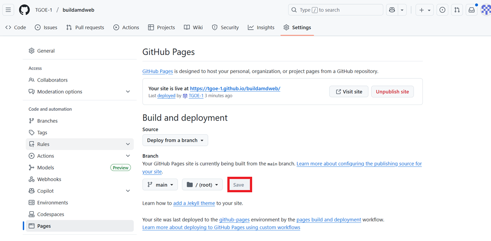
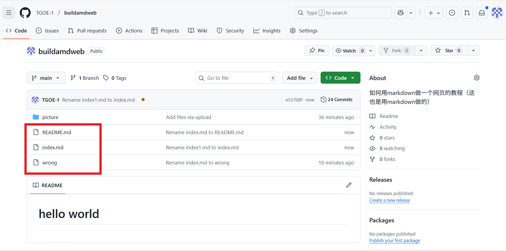
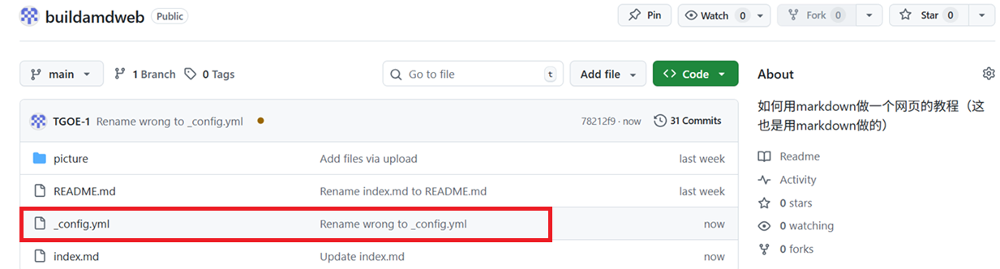
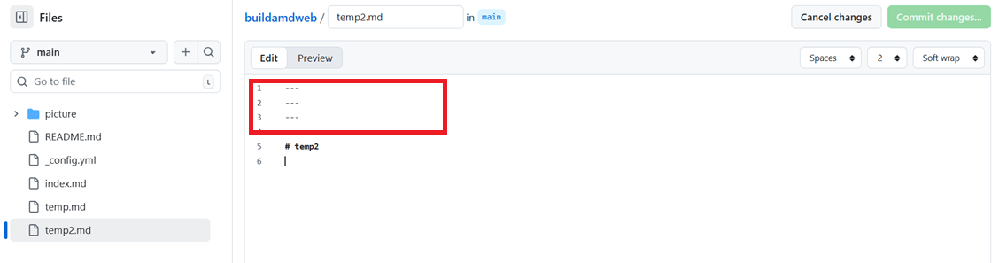

# 如何让你制作的网址获得一个域名？
---
## 操作步骤

### 打开你的github，在下图的红框处选择你要赋予域名的md代码所在库，双击它

### 进入库文件后，点击图片红框中的setting

### 点击setting中左下角红框的pages

### 在pages界面，先点击none打开列表

### 在列表中选择main

### 点击save

### 等待五分钟，刷新界面，绿框处就是你的网址域名，你可以直接点击边上的visit site，或者手动输入域名搜索

---

## 注意事项

### github会优先将名为index的文件设置为主页，否则查找README作为主页。请确保你的库中至少有这两个文件之一，如果没有这两个文件，将会报错

### 当你的库中有多个md文件时，github会使用Jekyll默认只对主页进行html转换，其他md仅作为文本文件。如果想让其他md文件也被Jekyll转换，有两种办法

#### 1.根目录中创建一个名为_config.yml的空文件

   
#### 2.每个非主页的md文件加上三行“---”

### 注意，HTML是浏览器唯一能识别和渲染的网页文件格式。Jekyll会将md文件转换成html文件，所以代码中使用超链接时，文件后缀的md应改为HTML

---
## 至此，我们的教程就结束了。你已经成功学会了如何赋予自己的网页一个域名。感谢你耐心读到这里，希望这份教程能对你有所帮助！

